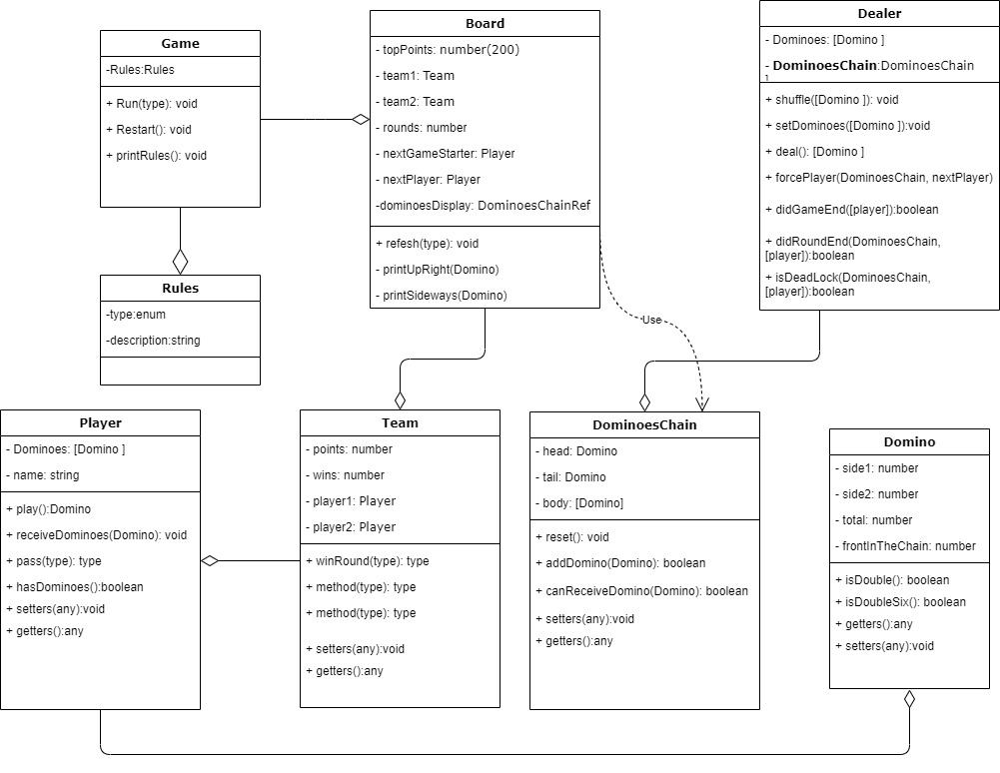

**Plan and analysis**

Read, understand, and process the feature.

El juego de domino

- 28 fichas
- 0 hasta 6
- Todas las combinaciones posibles de 0-6 (can use recursión)
- 7 fichas diferentes para cada uno de los números (can be the base case of a recursive function).
- ficha tiene un valor igual a la suma de los puntos en sus espacios:doble
- 4 jugadores
- 2 equipos
- 7 fichas a cada jugador (base case of recursión)
-  Si algún jugador tiene más de 3 dobles, el reparto se repite.
- que inicie el jugador que tenga doble seis
- y que siga jugando el próximo jugador.
- cada jugador coloca una ficha en uno de los extremos de la cadena si va por un solo lado.
- Cuando un jugador tiene más de una opción para jugar: utiliza un algoritmo random para decidir la jugada.
- en caso contrario debe pasar.
- Las fichas van formando una cadena, los extremos iguales de las fichas se colocan juntos.
- Las fichas dobles, que se colocan en dirección perpendicular a la cadena.
- Cuando un jugador tiene una sola opción de colocar ficha, después periodo de 3 segundos el programa lo hace automáticamente.
- Cuando uno de los 4 jugadores coloca todas sus fichas: la mano es ganada por la pareja a la que pertenece dicho jugador.
- Tranque: cuando ninguno de los 4 jugadores puede seguir colocando ninguna de sus fichas: se suman los puntos de las fichas que no han sido jugadas de cada pareja, gana la suma menor.
- En caso de empate, la mano no cuenta a efectos de puntuación.
- Al terminar la partida, la pareja ganadora obtiene la suma de todos los puntos de las fichas que no han sido colocadas por los cuatro jugadores.
- las siguientes, es el ganador de la mano anterior.
- Vence la partida la pareja que alcanza la puntuación acordada.

1. Haz un programa que prepare el inicio de un juego de dominoes. Esto incluye la estructura de datos de las piezas, barajarlas, y repartirlas entre 4 jugadores. Para probar, el juego puede imprimir en la consola las piezas de cada jugador.

1. Haz un programa que juegue una mano de dominoes
- que inicie el jugador que tenga doble seis
- y que siga jugando el próximo jugador.
- Cuando un jugador tiene más de una opción para jugar: utiliza un algoritmo random para decidir la jugada.
- Debes imprimir en la consola cada jugada, o alguna otra forma de validarlas.

1.

  - Haz un programa que juegue un juego hasta los 200 puntos
  - la primera mano abre con doble seis
  - las siguientes, es el ganador de la mano anterior.
  - Debes imprimir en la consola cada jugada, o alguna otra forma gráfica de validarlas.

**Design** :

Translate the requirement by writing a unit test. If you have hot reloading set up, the unit test will run and fail as no code is implemented yet.
    -test1: verifyCombinations(): •	Todas las combinaciones posibles de 0-6 por cada numero
    -test2: dealerHas28(): • retorna el numero total de dominos existentes en el Dealer(storage) dominos, esta tiene que ser 

**Implementation:**

Write and implement the code that fulfills the requirement. Run all tests and they should pass, if not repeat this step.

**Test:**

Clean up your code by refactoring.

Rinse, lather and repeat.